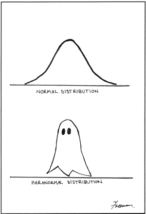
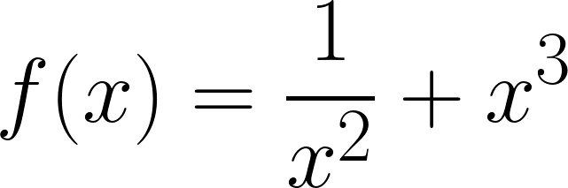
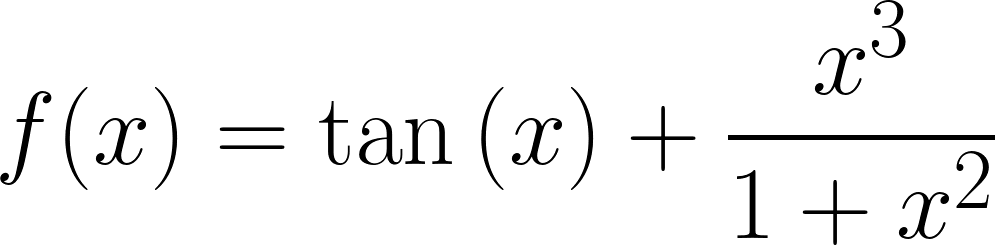

```{r setup, include=FALSE}
knitr::opts_chunk$set(echo = TRUE)
```

\

**Instructions:**
 
 * Please provide complete solutions for each problem. If it involves mathematical computations, explanations, or analysis, please provide your reasoning or detailed solutions.
 
 * Note that some problems have multiple solutions or ways to solve it. Make sure that your solutions are clear enough to showcase your work and understanding of the material.
 
 * Creativity and collaborations are encouraged. Use all of the resources you have and what you need to complete the mini-assignment. Each student must take personal responsibility and submit their work individually. Please abide by the University of Portland Academic Honor Principle.
 
 * **Please save your work as one pdf file, don't put your name in any part of the document, and submit it to the Teams Assignments for this course. Your document upload will correspond to your name automatically in Teams.**
 
 * If you have questions or concerns, please feel free to ask the instructor.

\newpage

## I. Introduction to R Studio and R Markdown

### Materials

R markdown is a straightforward and user-friendly plain text language that you may use to integrate your R code, data analysis findings (including plots and tables), and textual comments into one attractively structured and repeatable document (like a report, publication, thesis chapter or a web page like this one).

You can create mathematical equations using LaTeX math mode. The verbatim LaTeX syntax for the equation below is `y = \frac{s_y}{s_x} x + b`.

$$y = \frac{s_y}{s_x} x + b$$

You can embed R codes that can run while editing. The code chunks below can run simple R codes and outputs the results when you knit the R Markdown.

```{r simple-code-1, echo = TRUE}
1+1
```

```{r simple-code-2, echo = TRUE}
(cos(pi))^2 + (sin(pi))^2
```

You can embed pictures using a code chunk.

```{r paranormal-distribution-gif, echo=FALSE, fig.align="center", fig.cap="Paranormal Distribution", out.width = '50%'}

```

\

### Exercises

1. Write the following functions into latex math mode.

    a. 
    ```{r f1, echo=FALSE, fig.align="center", out.width = '20%'}
    
    ```

    b. 
    ```{r f2, echo=FALSE, fig.align="center", out.width = '30%'}
    
    ```

\

2. Create code chucks that computes the functions from problem 1 evaluated at $x = 1$. Make sure that your R code the output is shown when you knit the R Markdown.

\newpage

## II. BibTeX References and Citations in R Markdown

### Materials

R Markdown can use BibTeX references, which is useful for making scientific reports. This part of the mini-assignment uses the following files.

* The file named `references.bib` contains an entry of a BibTeX formatted reference shown below. The bib key to this entry is `R-base`.

```{}
@Manual{R-base,
  title = {R: A Language and Environment for Statistical Computing},
  author = {{R Core Team}},
  organization = {R Foundation for Statistical Computing},
  address = {Vienna, Austria},
  year = {2016},
  url = {https://www.R-project.org/},
}
```

* The file named `apa.csl` is a CSL (Citation Style Language) file which was downloaded from [Zotero Style Repository](https://www.zotero.org/styles){target="_blank"}. It contains code to generate citations and references within your document using the American Psychological Association (APA) 7th edition style.

\

### Exercises

1. Visit [Google Scholar](https://scholar.google.com/){target="_blank"} and search for "data science". Using the first item in the results, click the "Cite" button. Look for the BibTeX link, where it leads to another page showing the BibTeX formatted citation of the reference. Copy and paste the citation into a new line in the `references.bib` file. Show what you copied and pasted by filling in the verbatim code block below.

```{}
put your BibTeX formatted citation here and in the .bib file
```

\

2. We can cite references listed in our BibTeX file by using the bib keys of the references. We can start using those bib keys, using the following syntax:

    - `[@key]` for single citation or `[@key1; @key2]` for multiple citations
    - `@key` is also a valid syntax when using it in a sentence
    
    For citing the `R-base` bib key, we use `[@R-base]`, which is rendered as [@R-base]. Notice the `@` key character before the bib key to indicate that we are citing an entry from the BibTeX file which will show in the [References](#ref) section.
    
    Identify the bib key of the BibTeX reference you just added and cite it in two different ways: (a) as a single citation, and (b) use it in a sentence. You can use a made-up sentence for the purpose of this exercise.

\newpage

## III. Block Quotes in R Markdown

### Materials

We can add quotes from sources by using the block quotes feature in R Markdown. This is similar to a code block but block quotes are used to show text. Below is an example.

> "Sometimes the best way to solve your own problems is to help someone else."
>
> --- Iroh, [@atla]

\

### Exercises

1. Use the block quotes feature to quote something from your favorite movie or series.

\newpage

## References {#ref}

<div id="refs"></div>
