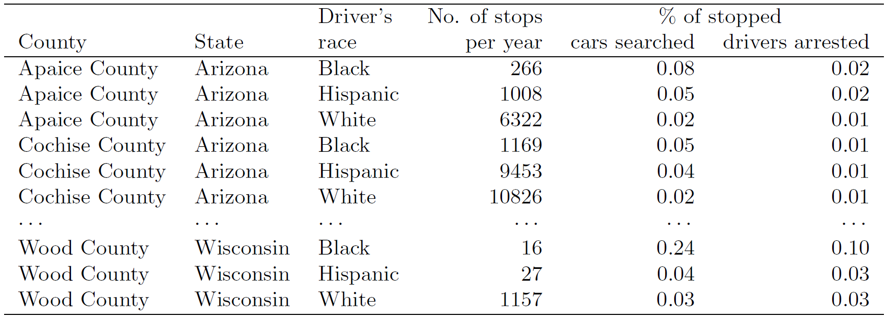

```{r setup, include=FALSE}
knitr::opts_chunk$set(echo = TRUE)
```

\

**Instructions:**
 
 * Please provide complete solutions for each problem. If it involves mathematical computations, explanations, or analysis, please provide your reasoning or detailed solutions.
 
 * Note that some problems have multiple solutions or ways to solve it. Make sure that your solutions are clear enough to showcase your work and understanding of the material.
 
 * Creativity and collaborations are encouraged. Use all of the resources you have and what you need to complete the mini-assignment. Each student must take personal responsibility and submit their work individually. Please abide by the University of Portland Academic Honor Principle.
 
 * **Please save your work as one pdf file, don't put your name in any part of the document, and submit it to the Teams Assignments for this course. Your document upload will correspond to your name automatically in Teams.**
 
 * If you have questions or concerns, please feel free to ask the instructor.

\newpage

## I. Experimental versus Observational Studies

### Materials

The exercises below are derived from the textbook [OpenIntro Statistics (4th edition)](https://www.openintro.org/book/os/){target="_blank"} by David Diez, Mine Cetinkaya-Rundel, and Christopher Barr.

### Exercises

1. **Eat better, feel better.** In a public health study on the effects of consumption of fruits and vegetables on psychological  well-being in young adults, participants were randomly assigned to three groups: (1) diet-as-usual, (2) an ecological momentary intervention involving text message reminders to increase their fruits and vegetable consumption plus a voucher to purchase them, or (3) a fruit and vegetable intervention in which participants were given two additional daily servings of fresh fruits and vegetables to consume on top of their normal diet. Participants were asked to take a nightly survey on their smartphones.Participants were student volunteers at the University of Otago, New Zealand. At the end of the 14-day study, only participants in the third group showed improvements to their psychological well-being across the 14-days relative to the other groups. [@conner2017let]

    a. What type of study is this? Explain why.
    b. Identify the explanatory and response variables.
    c. Comment on whether the results of the study can be generalized to
    the population, and comment on whether the results of the study can be used to establish
    causal relationships.
    d. A newspaper article reporting on the study states, ``The results of this study provide proof that giving young adults fresh fruits and vegetables to eat can have psychological benefits, even over a brief period of time.'' How would you suggest revising this statement so that it can be supported by the study?

2. **Stanford Open Policing.** The Stanford Open Policing project gathers, analyzes, and releases records from traffic stops by law enforcement agencies across the United States.Their goal is to help researchers, journalists, and policymakers investigate and improve interactions between police and the public. [@pierson2017large] The following is an excerpt from a summary table created based off of the data collected as part of this project.
    
    ```{r stanford-open-policing-table, echo=FALSE, fig.align="center", out.width = '85%'}
    
    ```

    a. What type of study is this? Explain why.
    b. What variables were collected on each individual traffic stop in order to create to the summary table above?
    c. State whether each variable is numerical or categorical. If numerical, state whether it is continuous or discrete. If categorical, state whether it is ordinal or not.
    d. Suppose we wanted to evaluate whether vehicle search rates are different for drivers of different races. In this analysis, which variable would be the response variable and which variable would be the explanatory variable?

\newpage

3. (Outstanding Question) **Reading the paper.** Below are excerpts from two articles published in the *NY Times*:

    a. An article titled *Risks: Smokers Found More Prone to Dementia* states the following: [@news:smokingDementia]

        > Researchers analyzed data from 23,123 health plan members who  participated in a voluntary exam and health behavior survey from 1978 to 1985, when they were 50-60 years old. 23 years later, about 25\% of the group had dementia, including 1,136 with Alzheimer's disease and 416 with vascular dementia. After adjusting for other factors, the researchers concluded that pack-a-day smokers were 37\% more likely than nonsmokers to develop dementia, and the risks went up with increased smoking; 44\% for one to two packs a day; and twice the risk for more than two packs.
    
        Based on this study, can we conclude that smoking causes dementia later in life? Explain your reasoning.
        
    b. Another article titled *The School Bully Is Sleepy* states the following: [@news:bullySleep]

        > The University of Michigan study, collected survey data from parents on each child's sleep habits and asked both parents and teachers to assess behavioral concerns. About a third of the students studied were identified by parents or teachers as having problems with disruptive behavior or bullying. The researchers found that children who had behavioral issues and those who were identified as bullies were twice as likely to have shown symptoms of sleep disorders.
        
        A friend of yours who read the article says, ``The study shows that sleep disorders lead to bullying in school children.'' Is this statement justified? If not, how best can you describe the conclusion that can be drawn from this study?

\newpage

## References {#ref}

<div id="refs"></div>
