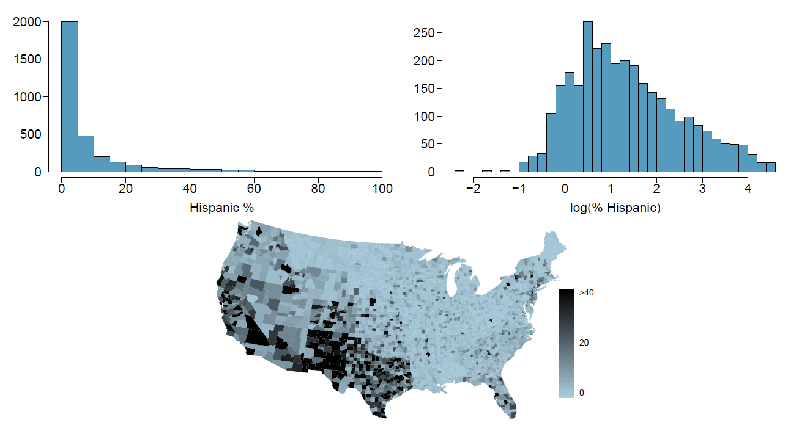

```{r setup, include=FALSE}
knitr::opts_chunk$set(echo = TRUE)
```

\

**Instructions:**
 
 * Please provide complete solutions for each problem. If it involves mathematical computations, explanations, or analysis, please provide your reasoning or detailed solutions.
 
 * Note that some problems have multiple solutions or ways to solve it. Make sure that your solutions are clear enough to showcase your work and understanding of the material.
 
 * Creativity and collaborations are encouraged. Use all of the resources you have and what you need to complete the mini-assignment. Each student must take personal responsibility and submit their work individually. Please abide by the University of Portland Academic Honor Principle.
 
 * **Please save your work as one pdf file, don't put your name in any part of the document, and submit it to the Teams Assignments for this course. Your document upload will correspond to your name automatically in Teams.**
 
 * If you have questions or concerns, please feel free to ask the instructor.

\newpage

## I. Exploring Numerical Data

### Materials

The exercises below are derived from the textbook [OpenIntro Statistics (4th edition)](https://www.openintro.org/book/os/){target="_blank"} by David Diez, Mine Cetinkaya-Rundel, and Christopher Barr.

### Exercises

1. **Hispanic Population.** The US census collects data on race and ethnicity of Americans, among many other variables. The histogram below shows the distribution of the percentage of the population that is Hispanic in 3,142 counties in the US in 2010. Also shown is a histogram of logs of these values.

    ```{r hispanic-population-figures, echo=FALSE, fig.align="center", fig.pos="H", out.width = '100%'}
    
    ```

    a. Describe the numerical distribution and comment on why we might want to use log-transformed values in analyzing or modeling these data.
    b. What features of the distribution of the Hispanic population in US counties are apparent in the map but not in the histogram? What features are apparent in the histogram but not the map?
    c. Is one visualization more appropriate or helpful than the other? Explain your reasoning.
    
\newpage

2. **Unemployment and Poverty.** Consider the scatterplot and the linear model shown in Fig. \@ref(fig:median-hh-income-poverty).

    ```{r median-hh-income-poverty, echo=FALSE, fig.align="center", fig.cap="A scatterplot of the unemployment rate against the poverty rate for the county dataset. A statistical model has also been fit to the data and is shown as a dashed line.", fig.pos="H", out.width = '100%'}
    
    ```

      a. What is the relationship between unemployment rate and poverty rate - is it linear or non-linear? Explain why.
      b. Would you consider the trend to be positively or negatively associated? Explain why.
      c. Comment on the variations shown in the scatterpot in the context of the variables. Are the variations show patterns of homoskedasticity or heteroskedasticity? Explain why. 
      
\newpage
      
3. (Outstanding Question) **Education Level.** Consider the number of observations per education level shown in Fig. \@ref(fig:education-level-observations), the unemployment rate summary statistics shown in Fig. \@ref(fig:education-level-summary), and the unemployment rate histograms and boxplots shown in Fig. \@ref(fig:education-level-distributions). 

    ```{r education-level-observations, echo=FALSE, fig.align="center", fig.pos="H", out.width = '60%', fig.cap = "Number of Observations"}
    
    ```
    
    ```{r education-level-summary, echo=FALSE, fig.align="center", fig.pos="H", out.width = '60%', fig.cap = "Summary Statistics"}
    
    ```

    ```{r education-level-distributions, echo=FALSE, fig.align="center", fig.pos="H", out.width = '80%', fig.cap = "Histograms (Plot A) and side by-side box plots (Plot B) for unemployment rates split by education level"}
    
    ```

    a. Compute the interquartile Range (IQR) for each education level. What does this number represent and where does it show in the boxplots? Explain why we can't compute the IQR of the below_hs variable.
    b. Using the mean and median, describe the skewness of the distributions, and which distribution is the most skewed. How many modes does each distribution have?
    c. What information does the box plots provide that the histograms does not - and vice versa? Give a general answer and a specific answer related to the data showed.
