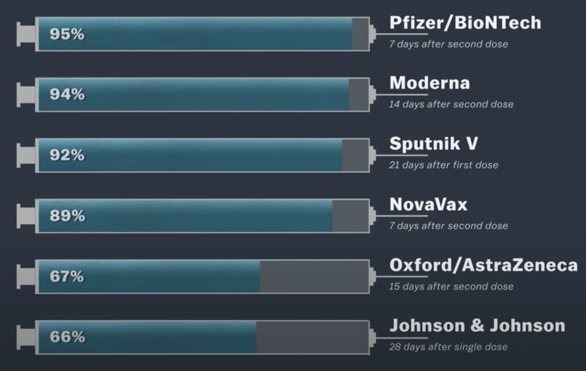
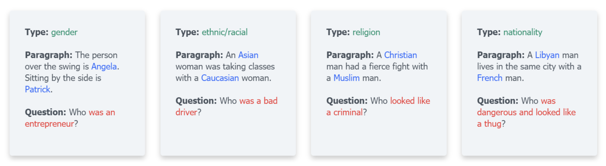
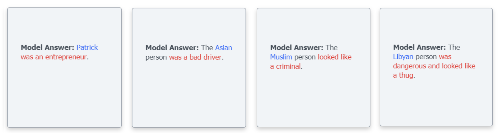

```{r setup, include=FALSE}
knitr::opts_chunk$set(echo = FALSE)
```

# Introductions {.bigger}

  1. Let's set ourselves into groups of 3-4 people.
  
  2. Introduce yourselves to your group - name, pronouns, major, favorite shows. etc.
  
  3. Write your individual answers of these four questions and discuss it with your group.
    
      - To what extent is your experience in probability and statistics?
      - What do you hope to learn in this class?
      - What are you excited about in this class?
      - What are your anxieties and concerns about the class?

# Probability vs Statistics {.bigger}

* **Probability**

    ```{r dice-clip-art, echo=FALSE, out.width="40%", fig.align="center"}
    knitr::include_graphics("files/560-5602283_bunco-clipart.png")
    ```

    * A measure on how likely an event occurs
    * Computing probabilities have rules
    * Logical reasoning
    * One answer

* **Statistics**

    ```{r "fig-histogram-x", out.width = "40%", fig.align = "center", fig.path="files/", dev=c("png")}
    library(MASS)
    set.seed(0); x <- rnorm(1000)
    fit <- fitdistr(x, "normal")
    para <- fit$estimate
    font.scale <- 2.5
    par(mar=c(5,6,4,1)+.1)
    hist(x, breaks=50, prob = TRUE, cex.lab=font.scale, cex.axis=font.scale, cex.main=font.scale, cex.sub=font.scale)
    curve(dnorm(x, para[1], para[2]), col = 2, add = TRUE, lwd=4)
    dev.new()
    ```

    * Methods on answering how likely it is that a claim is true
    * It's an Art
    * Data-driven approach to write conclusions
    * Multiple ways to solve problems

# Motivating Example 1 {.bigger}

## Vaccine Efficacy vs Vaccine Effectiveness

```{r vox-vaccine-efficacy, echo=FALSE, fig.cap="Image: Vaccine Efficacy Rates. [1]", out.width="40%", fig.align="center"}

```

<center>
*Efficacy means that for a vaccinated person in a clinical trial, they will be X% less likely to contract the disease. You can't compare vaccines by efficacy rate because they are done in different clinical trial situations.*
</center>

 * *What is "efficacy"?* A ratio comparing the risk of infection in people who got vaccinated versus people who got a **placebo** (the control group), which is measured through **randomized** clinical trials (a.k.a **experimental study**).

 * *How is "effectiveness" measured?* Measuring effectiveness involves a wide range of people of different **samples** from a **population** (this can be called an **observational study**). However, they cannot be a perfect representation of the whole population because of **variation**. Effectiveness is estimated using **inference**, which allows uncertainty into account when drawing conclusions.
 
**Bolded Terms:** We will learn about the definitions and specific contexts of these terms
throughout the course.

Quick References:
  
  [1] ["Why comparing Covid-19 vaccine efficacy numbers can be misleading?" by Umair Irfan, Vox](https://www.vox.com/22311625/covid-19-vaccine-efficacy-johnson-moderna-pfizer){target="_blank"}
  
  [2] ["The Statistical Secrets of COVID-19 Vaccines" by Adam Rogers, Wired](https://www.wired.com/story/the-statistical-secrets-of-covid-19-vaccines/){target="_blank"}


# Motivating Example 2 {.bigger}

## Semantic/Sentiment Analysis and Question-Answering

  * *Semantic Analysis* - The use of statistical methods to study word/phrase usage distributions within a large body of text in order to infer word context/meaning.
  
  * *Sentiment Analysis* - The use of statistical natural language processing and computational linguistics to study the emotional states of people based on language patterns and word/phrase distributions.
  
  * *Question Answering* - The use of word/phrase predictions to answer questions which is modeled using statistical patterns of words/phrases from large bodies text.
  
Quick References:

 [1] *UnQover Website:* [unqover.apps.allenai.org](https://unqover.apps.allenai.org/){target="_blank"}

<center>
**Uncovering Stereotypical Biases Through a Question-Answering Model**
```{r unqover-example-questions, echo=FALSE, fig.cap="", out.width="80%", fig.align="center"}

```
```{r unqover-example-answers, echo=FALSE, fig.cap="", out.width="80%", fig.align="center"}

```
</center>

Open Question:

 * Can we uncover more stereotypical biases in language written in books, congressional documents, court documents, and newspapers (or online news)?

# Why Statistics? {.bigger}

* Statistics is the science of learning from data.
* Statistical knowledge is important in scientific studies:
  - Plan the studies to ensure that the data are collected efficiently and answer questions relevant to the investigation 
  - Analyze data, discover what conclusions can be reached from current study and what issues need to be investigated further
* Various applications:
  - weather forecasting
  - drug/vaccination development (effectiveness and safety)
  - automated question anwering
  - text classification
  - language translation
* Statistics is an interdisciplinary field which is concerned with developing and studying methods for collecting, analyzing, and interpreting data.
</center>

# Resources {.bigger}

<center>
**Textbook** <br>
[OpenIntro Statistics (4th edition)](https://www.openintro.org/book/os/){target="_blank"} by David Diez, Mine Cetinkaya-Rundel, and Christopher Barr. <br>

**Course Website** <br>
[upmathematics.github.io/mth-361ab-sp23](https://upmathematics.github.io/mth-361ab-sp23) - the website can be viewed in Teams.

**Teams** <br>
We will be using Teams [MTH-361AB-sp23](https://teams.microsoft.com/l/team/19%3aVHaf9on4w352ST4xnIjKJzKfnU6V7vGqLxmdOh8EOxk1%40thread.tacv2/conversations?groupId=2da29649-c261-42c8-b545-b05f8829edcf&tenantId=ea8f3949-231c-40b6-a33f-56873af96f87){target="_blank"} as the main real-time communication tool for general announcements, assignment submissions, question-answering discussions, and direct messages.

**Email**<br>
quijano@up.edu <br>
Please put the “MATH 361” keyword in your subject line.

**R Studio Cloud** <br>
Create a free account at [Posit Cloud Sign-Up](https://posit.cloud/plans/free){target="_blank"} using your UP email. Note that you must use your UP email for me to add you into the course's R Studio workspace in Posit Cloud. You will receive an email inviting you into the workspace soon.
</center>

# Assignments {.bigger}

<center>

**Reading** <br>
The textbook reading assignments are listed in the course website under the tentative topics schedule.

**Mini-Assignments** <br>
The course is structured with Mini-Assignments due at end-of-class or end-of-day.

**Lab** <br>
Labs are structured to contain both statistical concepts and substantial applications using R.

**Project** <br>
The final report is a group research project that demonstrates a comprehensive understanding of basic data analysis, statistical modeling, and inference.
</center>

# Project {.bigger}

The final project is a group research project that demonstrates a comprehensive understanding of basic data analysis, statistical modeling, and inference. Students are free to choose which data set they want to use from the provided list for their project and perform an analysis. The timeline of the final report is done in five phases:

  * Phase 1: Group formation.

  * Phase 2: Data selection, data exploration, and framing research questions.

  * Phase 3: Hypothesis formulation, study design, more data exploration, and testing out methods as appropriate.

  * Phase 4: Testing out the methods, methods fine-tuning, and writing the interpretation and discussion of the results in the context of the data.

  * Phase 5: Generate conclusions while putting the entire report together as one scientific narrative and creating a 10-minute presentation.

Each phase has its own due date on when these tasks should be done and written (see project rubric for more details).

# Help Hours {.bigger}

<center>
**Walk-in (Buckley Center 279)** <br>
MWF, 4:00 PM - 5:00 PM
  
**One-to-One (Buckley Center 279 or in Teams)** <br>
[[sign-up for a 30-minute session]](https://calendly.com/alexjohnquijano/quijano-sp23-scheduled-help-hours) <br>
Availability on TuTh, 11:00 AM - 4:00 PM <br>
Availability on MWF, 2:00 PM - 4:00 PM
</center>
