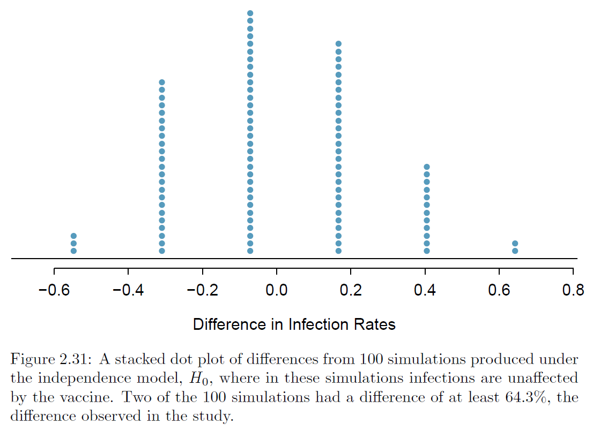

```{r setup, include=FALSE}
knitr::opts_chunk$set(echo = FALSE)
```

```{r echo=FALSE, message=FALSE, warning=FALSE}
library(tidyverse)
library(openintro)
library(kableExtra)
```

# Previously... {.bigger}

* Types of variables - **Numerical** or **Categorical**
    - Numerical: Continuous or Discrete
    - Categorical: Nominal or Ordinal
* Sampling Methods - **Simple**, **Stratified**, and **Clustered**
    - Problematic sampling - Cherry picking, voluntary, and convenience sampling
* Numerical variables - **Skewness** and **Modality**
    - Skewness: Positive or Negative skew distributions
    - Modality: Unimodal, Bimodal, or Multimodal
* Categorical Variables - **Contingency Tables**
    - Contingency Tables: Row, column, and total proportions

# Previously... {.bigger}

* Relationship between Variables - **Association** versus **Independence**
    - A pair of variables are either associated or independent, not both.
* Types of studies - **Observational** versus **Experimental** Studies
    - Observational Types: Prospective or Retrospective
    - Experimental Principles: Controlling, Randomization, Replication, and Blocking
* Types of conclusions - **Association** $\ne$ **Causation**
    - Positive or Negative Linear (or Non-Linear) associations for numerical variables
    - Causation can only be inferred from a randomized experiment

# Goals {.bigger}

  1. Synthesize the terminologies in context of a case study.
  2. Apply the independence assumption.
  3. Understand the overall concept of applied statistics.

# Case Study: Using Stents to Prevent Strokes {.bigger}

*Research Question:* Does the use of stents reduce the risk of stroke?

The researchers who asked this question conducted an experiment with 451 at-risk patients.
Each volunteer patient was randomly assigned to one of two groups:

**Treatment group.** Patients in the treatment group received a stent and medical management. The medical management included medications, management of risk factors, and help in lifestyle modification.

**Control group.** Patients in the control group received the same medical management as the
treatment group, but they did not receive stents.

Researchers randomly assigned 224 patients to the treatment group and 227 to the control group.

Researchers studied the effect of stents at two time points: 30 days after enrollment and 365 days after enrollment.

# Case Study: Using Stents to Prevent Strokes {.bigger}

<center>
**0-30 Days Data**

```{r echo=FALSE, message=FALSE, warning=FALSE}
# datasets
kable(table(stent30))
```
</center>

Questions:

1. What is the proportion who had a stroke in the treatment (stent) group?
2. What is the proportion who had a stroke in the control group?

  >- $p_{30}(\text{stroke given treatment}) = \frac{33}{224} = 0.1473$
  
  >- $p_{30}(\text{stroke given control}) \frac{13}{227} = 0.0573$
  
# Case Study: Using Stents to Prevent Strokes {.bigger}  

<center>
**0-365 Days Data**

```{r echo=FALSE, message=FALSE, warning=FALSE}
# datasets
kable(table(stent365))
```
</center>

Questions:

1. What is the proportion who had a stroke in the treatment (stent) group?
2. What is the proportion who had a stroke in the control group?

  >- $p_{365}(\text{stroke given treatment}) = \frac{45}{224} = 0.2009$
  
  >- $p_{365}(\text{stroke given control}) \frac{28}{227} = 0.1233$

# Case Study: Using Stents to Prevent Strokes {.bigger}

Now, let's look at the summary statistics more carefully.

* Treatment Group:
  - $p_{30}(\text{stroke given treatment}) = \frac{33}{224} = 0.1473$
  - $p_{365}(\text{stroke given treatment}) = \frac{45}{224} = 0.2009$

* Control Group:
  - $p_{30}(\text{stroke given control}) \frac{13}{227} = 0.0573$
  - $p_{365}(\text{stroke given control}) \frac{28}{227} = 0.1233$
  
Discussion Question: Given the original research question and the proportions above, what can you say about the difference in proportions between the treatment and control (and also between 30 to 365 days)?

# Case Study: Using Stents to Prevent Strokes {.bigger}

An additional 8\% of patients in the treatment group had a stroke! 

This is important for two reasons. 

* It is contrary to what doctors expected, which was that stents would reduce the rate of strokes. 

* It leads to a statistical question: Do the data show a "real" difference between the groups?

# Case Study: Using Stents to Prevent Strokes {.bigger}

$H_0:$ Independence model. The variables treatment and outcome are independent. They have no relationship, and the observed difference between the proportion of patients who had a stroke is due to chance.

$H_A$: Alternative model. The variables are not independent. The difference in proportion was not due to chance, and the stents reduced the risk of strokes.

Discussion Questions:

1. What are the variables - include what's shown and what is not shown - involved in this study?

2. What are your thoughts on the meaning of "due to chance" written in the hypotheses?

3. What would it mean if the independence model, which says the stents had no influence on reducing risk of stroke, is true?

# Case Study: Malaria Vaccine {.bigger}

We consider a study on a new malaria vaccine called PfSPZ. In this study, volunteer patients were randomized into one of two experiment groups: 14 patients received an experimental vaccine and 6 patients received a placebo vaccine. Nineteen weeks later, all 20 patients were exposed to a drug-sensitive malaria virus strain; the motivation of using a drug-sensitive strain of virus here is for ethical considerations, allowing any infections to be treated effectively.

Data:

<center>
```{r}
# dataset
kable(table(malaria))
```
</center>

Discussion Questions: 

1. Is this an observational study or an experiment? 
2. What implications does the study have?
3. what can be inferred from the results?

# Case Study: Malaria Vaccine {.bigger}

$H_0$: Independence model. The variables treatment and outcome are independent. They have
no relationship, and the observed difference between the proportion of patients who developed
an infection in the two groups, 64.3%, was due to chance.

$H_A$: Alternative model. The variables are not independent. The difference in infection rates of 64.3% was not due to chance, and vaccine affected the rate of infection.

```{r echo=FALSE}
# Calculate conditional probabilities of infection after vaccine/placebo
malaria %>%
  count(treatment, outcome) %>%
  group_by(treatment) %>%
  mutate(prop = n / sum(n))
```

Discussion Questions: 

1. What is the difference in proportions we should use in order to test our hypothesis?
2. what is the meaning of this difference under the independence assumption?

# Case Study: Malaria Vaccine {.bigger}

One way to test these two competing claims is through randomization/simulations.

```{r randomization-heart-transplants-mosaic, echo=FALSE, fig.align="center", fig.pos="H", out.width = '60%'}
    
```

# Case Study: Malaria Vaccine {.bigger}

The difference of 64.3\% being a rare event suggests two possible interpretations of the results of the study:

$H_0$ Independence model. The vaccine has no effect on infection rate, and we just happened to observe a difference that would only occur on a rare occasion.

$H_A$ Alternative model. The vaccine has an effect on infection rate, and the difference we observed was actually due to the vaccine being effective at combating malaria, which explains the large difference of 64.3%.

Discussion Questions: What can we conclude based on this simulation?
